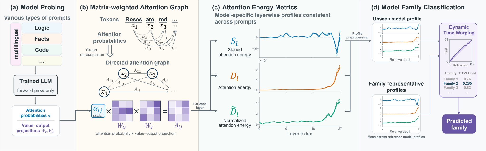

# MAGE: Matrix-Weighted Attention Graph Energies for LLM Family Fingerprinting

## Abstract

Limited transparency in large language model (LLM) development motivates provenance analysis to distinguish independently developed models from derivatives. We introduce Matrix-weighted Attention Graph Energies (MAGE), a framework for extracting attention metrics that can be used as model fingerprints. MAGE represents self-attention as a matrix-weighted graph, with tokens as nodes and attention-weighted value–output projection matrices as edge weights. Inspired by this representation and the Laplacian quadratic energy form, we define three attention energy metrics. Each metric’s layerwise profiles show high within-model Pearson correlations across the evaluated prompts. This consistency despite input-dependent attention supports their use as model fingerprints. To evaluate the utility of these profiles, we construct a model family classifier that compares the three metrics’ z-score-normalized layerwise profiles using Dynamic Time Warping (DTW). With a fixed bank of 23 reference models from six families, the classifier achieves 25/30 accuracy in a development evaluation on models outside the bank. Separately, predictions for three of four DeepSeek distilled models match their documented Qwen or Llama base lineages rather than their DeepSeek product identity. We also evaluate robustness under LoRA-based supervised fine-tuning: the fixed classifier retains correct family predictions for all 32 post-training checkpoints from eight source models. These results suggest that MAGE captures consistent attention characteristics across prompts useful for model family identification and base-lineage analysis.
